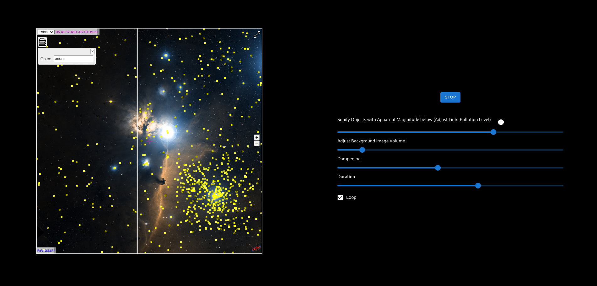
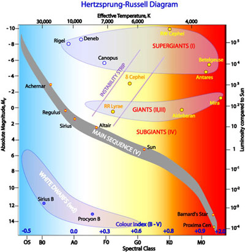

# Space Sonification

## How to start

To start a development server, you can use

```
npm install
npm start
```

Then, a browser window with the application will open.

## How to use

 

On the left, you can navigate in the night sky. On the right, you can control the parameters of the sonification. Pressing the play button starts the sonification. While it is running, you cannot navigate further in the sky and changing the parameters on the left will have no effect.

### Adjustable Parameters

- Apparent Magnitude Trheshold. The first slider controls how bright a star needs to be (according to its apparent magnitude) to be included in the sonification. It hence simulates light pollution.  Note that the brighnes of a star is measured in units of magnitude where smaller values indicate brighter stars (e.g. the sun has a magnitude of -27). The scale is further logarithmic, i.e., a change in one unit of magnitude corresponds to a change in brightness by a factor of about 2.512. 

- Background Image Volume. The second slider controls how loud the background image will seem, i.e., it controls the volume of this part of the sonification.

- Dampening. Stars of sufficently large apparent magnitude are included in the second part of the sonification, but the volume of their corresponding sound depends on their apparent magnitude. More precisely, a star with a magnitude of $m$ produces a sound of volume porportional to $max(1, m)^{-d}$ where $d$ is the parameter adjustable by the slider. Higher values of $d$ make low brightness stars seem more silently. High values are useful if the number of sufficiently bright stars is large

- Duration: Controls how long (in seconds) one cycle of the sonification is. The length of one cycle is the time it takes for the line to go from left to right in the image.

- Loop: If enebled, the sonification is repeaded indefinitely. Otherwise it stops automatically after one cycle.

## How it works

The sonification consists of the following two components that are played simultaneously.

### Background Image Sonification

For sonification of the background image, the image is divided into $n \times m$ rectangular tiles. Each column (consisting of $n$ tiles), corresponds to one characteristic sound with $n$ partial tones of base frequency $50 Hz$. The amplitude of each partial tone is set equal to the average pixel value of the corresponding tile. As the line moves over the image, the gain of each characteristic sound is chosen based on the position of the line. More pecisely, all $m$ gains are $0$ except for the two gains corresponding to leftmost and rightmost gain as seen from the position of the line. Their respective gain is equal to the normalized distance in $x$ direction betwen the mid of the column and the line such that it changes linearly from $0$ to $1$ to $0$ as the line moves.

### Star Sonification

Stars of sufficiently large apparent magnitude are sonified using an `AMSynth` from `Tone.js`. Each star triggers a characteristic ASDR envelope. The velocity (or gain) is chosen based on the apparent magnitude $m$ of the star and set to $\frac{1}{2}max(1,m)^{-d}$, where $d$ is the dampening controlled by the second slider. 

The pitch is chosen based on the type of the star. One very common star classification scheme is the Hertzsprung-Russel diagram:

 

Here, the $x$-axis shows the spectral type of the star, which indicates its temperature and in turn its color. We respect only the main class of the spectral type, indicated by the letters $O, B, A, F, G, K, M$ (and discard the subclass, indicated by a number). Very hot stars (spectral class O) are blue and reach surface temperatures of up to 30000 K, whereas the other extreme are are red and rather cool type M stars (only having a surface temperature of around 3000 K). The $y$-axis indicates the absolute magnitude of a star, i.e., its brightness if it were at a fixed, standardized distance from earth. As shown by the enclosed regions in the diagram, stars are further grouped into one of the luminosity classes $0, Ia, Ib, II, III, IV, V, VI$ and $VII$. This luminosity class makes a statement about the development and the size of a star. Type $0$ stars are the largest and most massive stars existing, whereas type $V$ stars are rather ordinary stars like our sun (we excluded white dwarfs here who form a special extra class). Based on these two parameters that can be summarized as describing the size and the temperature of a star, we choose a pitch and a note value to play.

In our sonification, the luminosity class determines the octave in which the sound should be played (which is set as corresponding index of the array $[0, Ia, Ib, II, III, IV, V, VI]$), whereas the spectral class determines the exact note, i.e., the matching index in the array $[O, B, A, F, G, K, M]$ determines the note from the array $[C, D, E, F, G, A, H]$. The note value is chosen based on the apparent magnitude such that the tone is sustained longer for brighter stars. More precisely, we use the following piece of code (in case you're interested) 

```
function to_val(magnitude) {
    if (magnitude < 1) return '4n';
    
    if (magnitude < 2) return '4n';
    if (magnitude < mag_limit/2) return '8n';
    if (magnitude < mag_limit/1.5) return '16n';
    return '16n';
}
```

where `mag+_limit` is the maximum apparent magnitude a star can have in order to be included in the sonification. 